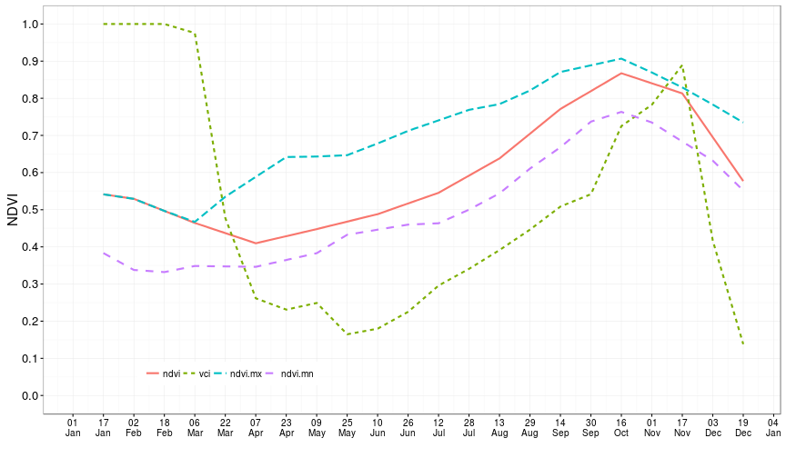

## Summary

This is an example of making presentations using Slidify used to show one application made on Shiny to show the assessment of the agricultural drought on the BioBio Region of Chile for the last sixteen years. This webmapping show the Vegetation Condition Index (VCI) aggregated at administrative unit on the Region for each period of 16 days, also present the Standarized Precipitation Index (SPI) for 26 weather stations.

---

## Vegetation Condition Index (VCI)

This is the equation for the vegetation condition index calculated from data of NDVI.

$$VCI = \frac{NDVI - NDVI_{min}}{NDVI_{max}-NDVI_{min}}$$

---

## Derivation of VCI 

---

## Derivation of VCI

---

## Hyperlink to an a Shiny app

<iframe src="https://frzambra.shinyapps.io/shinyapp/" width=100% height=500 allowtransparency="true"> </iframe>
